<!-- Copy source: scripts/build_readmes.py -->
<a href="assets/header-dark.svg#gh-dark-mode-only"><picture>
<source media="(max-width: 600px)" srcset="assets/header-mobile-dark.svg">
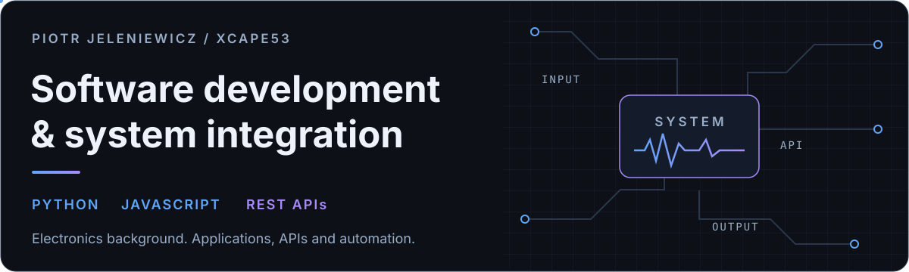
</picture></a>
<a href="assets/header-light.svg#gh-light-mode-only"><picture>
<source media="(max-width: 600px)" srcset="assets/header-mobile-light.svg">
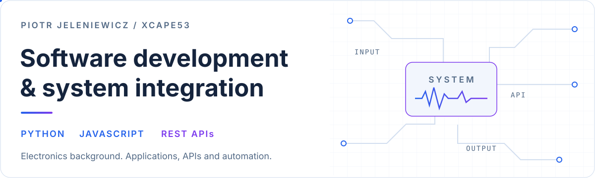
</picture></a>

**English** · [Polski](README.pl.md) &nbsp; | &nbsp; [Portfolio](https://piotrjeleniewicz.com/) · [LinkedIn](https://www.linkedin.com/in/piotr-jeleniewicz/)

I develop Python and JavaScript applications, integrate services through APIs and build automation tools. I am interested in system design and software that connects with devices.

I study Electronics and Telecommunications at Gdańsk University of Technology, in the Electronics stream, specialising in Computer Electronic Systems. I am in the final semester of my engineering degree.

## Selected projects

<table>
<tr>
<td width="50%" valign="top">
<a href="https://github.com/Xcape53/Yapper"><picture><source media="(prefers-color-scheme: dark)" srcset="assets/projects/yapper-dark.svg">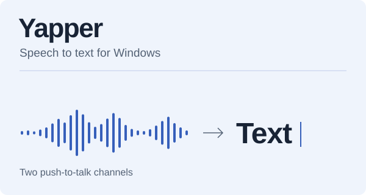</picture></a>

<strong><a href="https://github.com/Xcape53/Yapper">Yapper</a></strong>

A Windows speech-to-text app with two push-to-talk channels, online/offline transcription and clipboard output. I use it daily.

Python / PyQt6 / speech APIs

<a href="https://github.com/Xcape53/Yapper">Repository</a> · <a href="https://github.com/Xcape53/Yapper/releases">Releases</a>

</td>
<td width="50%" valign="top">
<a href="https://github.com/Xcape53/SeeSky-tracking"><picture><source media="(prefers-color-scheme: dark)" srcset="assets/projects/seesky-dark.svg">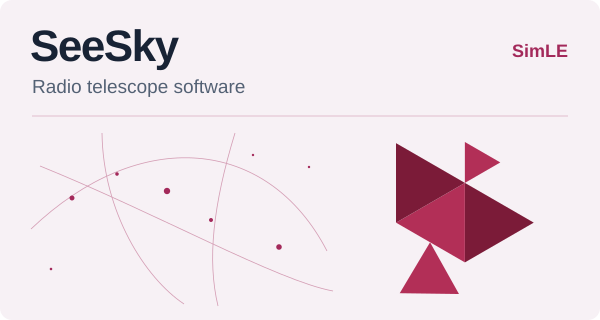</picture></a>

<strong><a href="https://github.com/Xcape53/SeeSky-tracking">SeeSky</a></strong>

Radio telescope software for SimLE. I lead software development, covering the backend, web interface and interactive sky visualisation.

Python / Flask / Astropy / JavaScript

<a href="https://github.com/Xcape53/SeeSky-tracking">Repository</a> · <a href="https://xcape53.github.io/SeeSky-tracking/">UI demo</a>

</td>
</tr>
<tr>
<td width="50%" valign="top">
<a href="https://piotrjeleniewicz.com/#p-jobagg"><picture><source media="(prefers-color-scheme: dark)" srcset="assets/projects/jobmanager-dark.svg">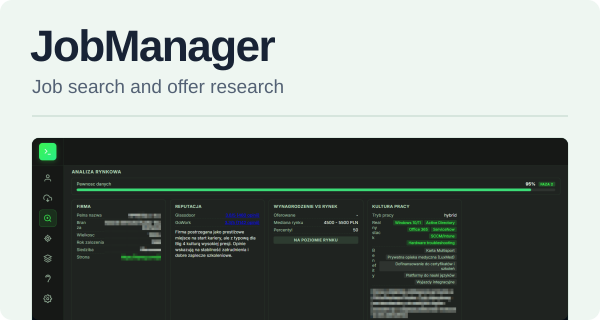</picture></a>

<strong><a href="https://piotrjeleniewicz.com/#p-jobagg">JobManager</a></strong>

A personal tool that brings job listings from multiple portals into one workflow, with shared filters, AI-assisted research and notifications.

Data aggregation / Gemini API / automation

<a href="https://piotrjeleniewicz.com/#p-jobagg">Project overview</a> · <a href="https://piotrjeleniewicz.com/#p-jobagg">Screenshots</a>

</td>
<td width="50%" valign="top">
<a href="https://piotrjeleniewicz.com/"><picture><source media="(prefers-color-scheme: dark)" srcset="assets/projects/portfolio-dark.svg">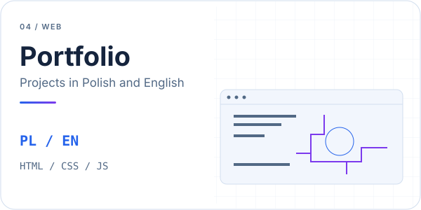</picture></a>

<strong><a href="https://piotrjeleniewicz.com/">Portfolio</a></strong>

My Polish and English portfolio: project galleries, responsive layouts and custom electronics-inspired visual effects.

HTML / CSS / JavaScript / GitHub Pages

<a href="https://piotrjeleniewicz.com/">Website</a> · <a href="https://github.com/Xcape53/portfolio">Source</a>

</td>
</tr>
</table>

SeeSky: hardware and SDR integration are the next stage. The demo shows the interface without live star or sensor data.

Application screenshots

**JobManager** - offer research view from my public portfolio.

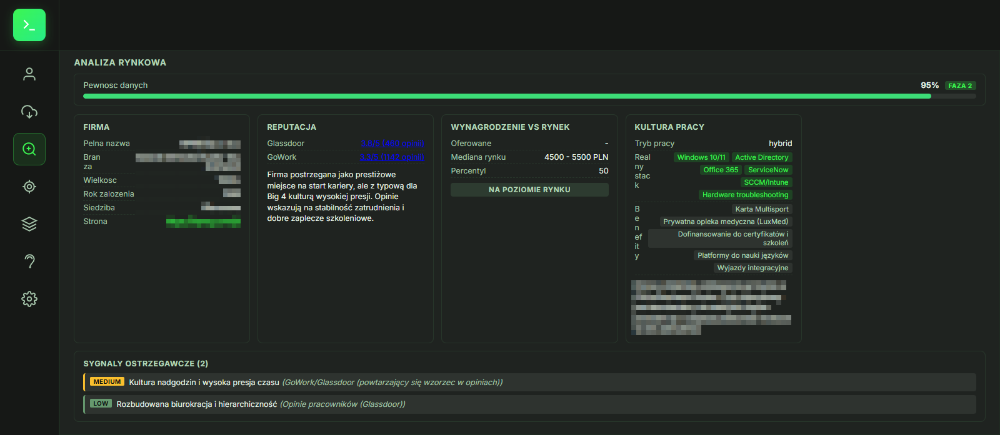

**SeeSky** - interface demo, without a connected backend or sensor data.

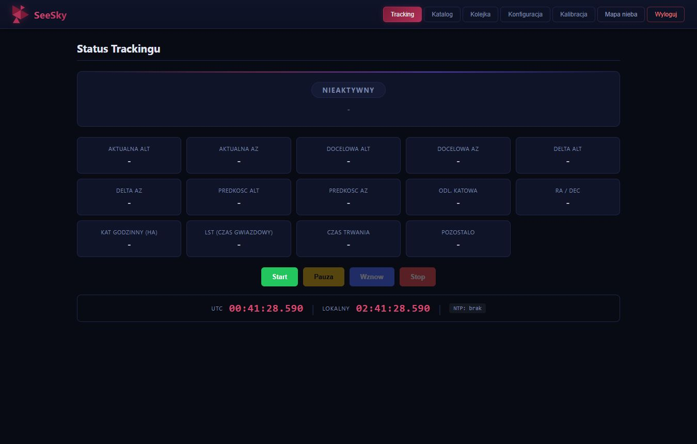

**Portfolio**

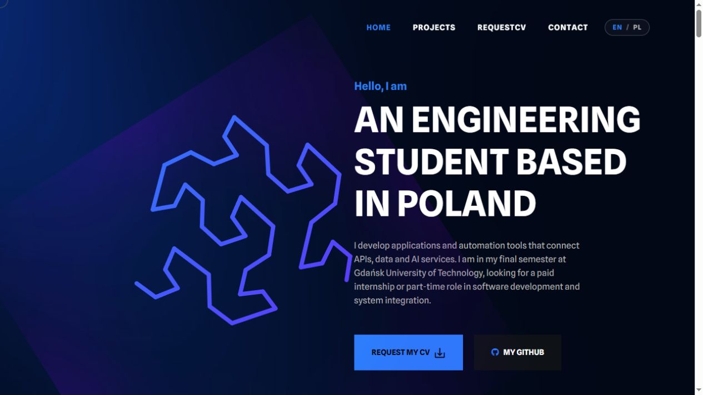

## How I work with AI

I start with the problem and expected behaviour, define module responsibilities and interfaces, then integrate the components. AI development tools support implementation and debugging; I guide development and verify how the system behaves.

**Example - JobManager:** collection, filtering, research and notifications have separate responsibilities within one workflow. I improve them iteratively through daily use.

<a href="assets/workflow-dark.svg#gh-dark-mode-only"><picture>
<source media="(max-width: 600px)" srcset="assets/workflow-mobile-dark.svg">
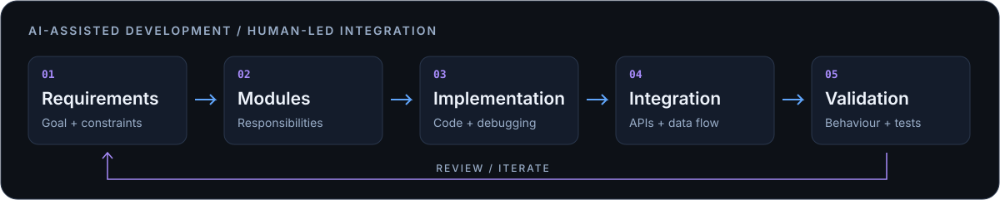
</picture></a>
<a href="assets/workflow-light.svg#gh-light-mode-only"><picture>
<source media="(max-width: 600px)" srcset="assets/workflow-mobile-light.svg">
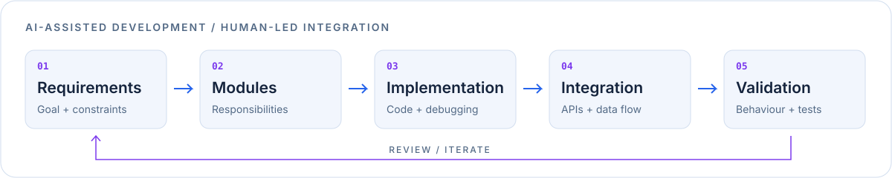
</picture></a>

**Core tools:** Python · JavaScript · REST APIs · Git. My electronics background also includes measurement, simulation and circuit-design labs.

## Public project activity

<a href="assets/activity-dark.svg#gh-dark-mode-only"><picture>
<source media="(max-width: 600px)" srcset="assets/activity-mobile-dark.svg">
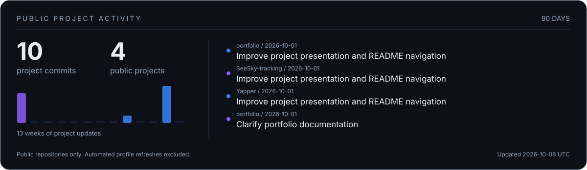
</picture></a>
<a href="assets/activity-light.svg#gh-light-mode-only"><picture>
<source media="(max-width: 600px)" srcset="assets/activity-mobile-light.svg">
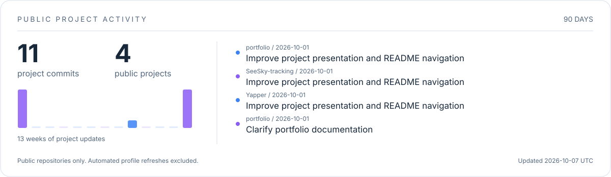
</picture></a>

The panel covers Yapper, SeeSky-tracking, portfolio and LabInc over the past 90 days, excluding bots. The arcade below uses publicly searchable commits from the past year.

<picture>
<source media="(prefers-color-scheme: dark)" srcset="assets/arcade/galaga-dark.svg">
</picture>

The SVG plays automatically. Data refreshes daily; private activity is not included. Animation: <a href="https://github.com/abozanona/pacman-contribution-graph">pacman-contribution-graph</a>.

More projects and an alternative arcade

- **[LabInc: Chemical Tycoon](https://github.com/Xcape53/LabInc)** - a Java economy game with production modelling, state persistence and a Swing interface.
- **[Inventory generator](https://piotrjeleniewicz.com/inventoryGen/index.html)** - an interactive web tool for arranging Minecraft-style inventories.
- **[Turf Matchmaking](https://github.com/Xcape53/TurfMatchMaking)** - a game-lobby finder with filters, live-data validation and retries.

<picture>
<source media="(prefers-color-scheme: dark)" srcset="assets/arcade/breakout-dark.svg">
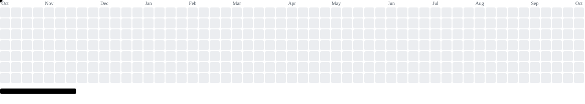
</picture>

<picture>
<source media="(prefers-color-scheme: dark)" srcset="assets/calendar-dark.svg">
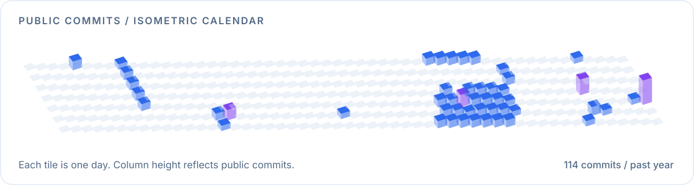
</picture>

## Contact and availability

I am looking for a **paid internship or part-time role** in software development, system integration or automation. I prefer **remote work or a hybrid role in Tricity, Poland**.

[Contact me through my portfolio](https://piotrjeleniewicz.com/#contact) · [LinkedIn](https://www.linkedin.com/in/piotr-jeleniewicz/)

CV available on request.

Static artwork

<picture>
<source media="(prefers-color-scheme: dark)" srcset="assets/header-dark-static.svg">
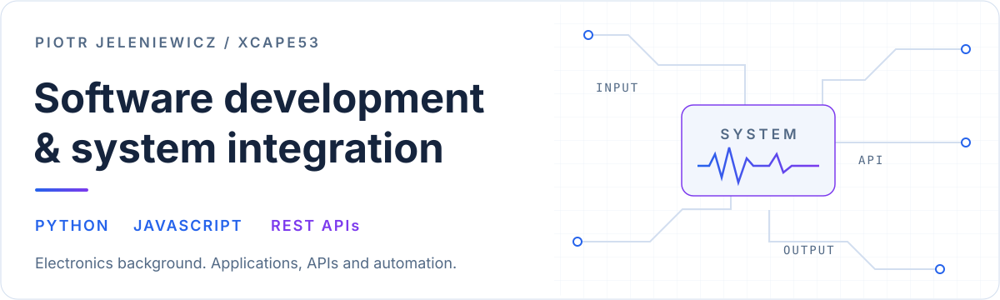
</picture>

