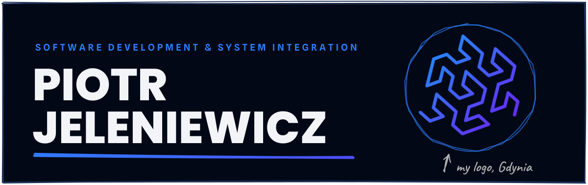
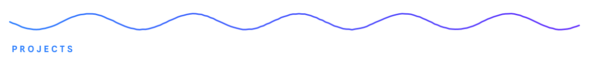
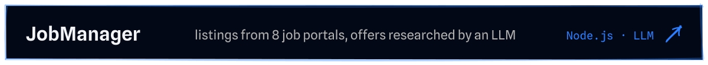
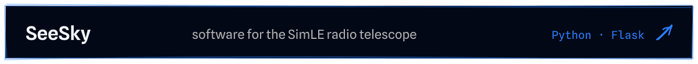
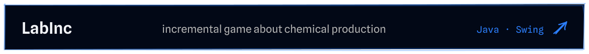
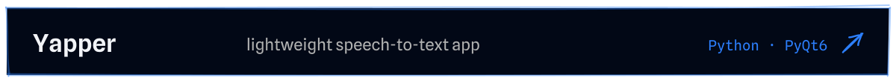
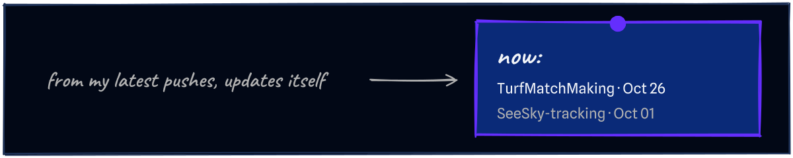

<!-- Artwork: python scripts/build_sketch.py ("now" card refreshes daily in .github/workflows/update-profile.yml) -->
<a href="https://piotrjeleniewicz.com/en/"><picture><source media="(max-width: 600px)" srcset="assets/sketch/header-en-m.svg"></picture></a>

I build applications and automation tools that connect APIs, data and AI services. I'm in my final semester of Electronics and Telecommunications at Gdańsk University of Technology, and I've been into automation since primary school.

**[Portfolio](https://piotrjeleniewicz.com/en/)** · [LinkedIn](https://www.linkedin.com/in/piotr-jeleniewicz/) · [Polski](README.pl.md)

<picture><source media="(max-width: 600px)" srcset="assets/sketch/divider-en-m.svg"></picture>

<a href="https://piotrjeleniewicz.com/en/#p-jobmanager"><picture><source media="(max-width: 600px)" srcset="assets/sketch/project-1-en-m.svg"></picture></a>
<a href="https://github.com/Xcape53/SeeSky-tracking"><picture><source media="(max-width: 600px)" srcset="assets/sketch/project-2-en-m.svg"></picture></a>
<a href="https://github.com/Xcape53/LabInc"><picture><source media="(max-width: 600px)" srcset="assets/sketch/project-3-en-m.svg"></picture></a>
<a href="https://github.com/Xcape53/Yapper"><picture><source media="(max-width: 600px)" srcset="assets/sketch/project-4-en-m.svg"></picture></a>

<a href="https://github.com/Xcape53?tab=repositories&sort=updated"><picture><source media="(max-width: 600px)" srcset="assets/sketch/now-en-m.svg"></picture></a>

